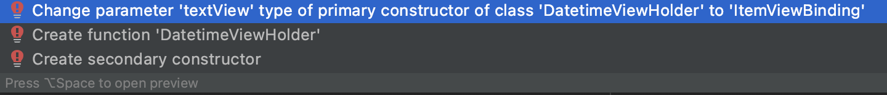

# Recycler View

# Topics
- Understand RecyclerView, ViewHolder
- Use DiffUtil
- Use DataBinding & Binding Adapter

## Basic Requirements

Complete exercises below

## Exercise 1. Creating a RecyclerView with ViewHolder

- Given the code in [this repo](https://github.com/CodeOp-tech/bumble-android-assignments/tree/master/android-recycler-view/android_recycler_view_ex1):
	- Replace the `TextView` for a `RecyclerView`, and make it run

### Solution

- In order to add the `ReciclerView` for you code, you need to follow some steps:
	- **1.** Inside `fragment_datetime.xml`, remove the `TextView` and add a `RecyclerView`:
		```
		<androidx.recyclerview.widget.RecyclerView
		   android:layout_width="match_parent"
		   android:layout_height="match_parent" />
		```
	- **2.** Add a layout manager to the RecyclerView XML:
		```
		app:layoutManager="androidx.recyclerview.widget.LinearLayoutManager"
		```
	- **3.** Add the `android:enabled` from the `TextView` inside the `RecyclerView`:
		```
		android:enabled="@{myViewModel.timestampVisible}"
		```
	- **4.** Add an `id` to the `RecyclerView`:
		```
		android:id="@+id/recyclerView"
		```
	- **5.** Create the list item layout:
		- **5.1.** Create a layout file called `item_view.xml`
		- **5.2.** In `item_view.xml` delete all the given code and add a `TextView`:
			```
			<?xml version="1.0" encoding="utf-8"?>
			<androidx.appcompat.widget.AppCompatTextView xmlns:android="http://schemas.android.com/apk/res/android"
			    xmlns:tools="http://schemas.android.com/tools"
			    android:id="@+id/textItem"
			    android:layout_width="match_parent"
			    android:layout_height="wrap_content"
			    android:paddingStart="16dp"
			    android:paddingEnd="16dp"
			    android:textSize="24sp"
			    tools:text="2021-01-01 00:01:02" />
			```
	- **6.** Open `Util.kt`, scroll to the end, and add a `ViewHolder`:
		```
		class DatetimeViewHolder(val textItem: TextView): RecyclerView.ViewHolder(textItem)
		```
	- **7.** Create a class `DatetimeAdapter.kt` and:
		- **7.1.** Make `DatetimeAdapter` class extend `RecyclerView.Adapter`
			```
			class DatetimeAdapter: RecyclerView.Adapter<DatetimeViewHolder>() {}
			```
		- **7.2.** Click `ALT + ENTER` above the `DatetimeAdapter` and implement all required methods:
			```
			override fun onCreateViewHolder(parent: ViewGroup, viewType: Int): DatetimeViewHolder {
			    TODO("Not yet implemented")
			}

			override fun onBindViewHolder(holder: DatetimeViewHolder, position: Int) {
			    TODO("Not yet implemented")
			}

			override fun getItemCount(): Int {
			    TODO("Not yet implemented")
			}
			```
		- **7.3.** Inside `DatetimeAdapter`:
			- **7.3.1.** At the top level of `DatetimeAdapter` create a listOf `String` variable to hold the datetime data:
				```
				var data =  listOf<String>()
				```
			- **7.3.2.** Override `getItemCount()` to return the size of the list of datetime in data
				```
				override fun getItemCount() = data.size
				```
		- **7.4.** Inside `onBindViewHolder()`:
			- **7.4.1.** Create a variable for one item at a given position in the data.
				```
				val item = data[position]
				```
			- **7.4.2.** The `ViewHolder` we created earlier has a property called `textView`
			- **7.4.3.** Inside `onBindViewHolder()` set the text of the `textView` with the current datetime item:
				```
				holder.textView.text = item
				```
		- **7.5.** In `onCreateViewHolder()`:
			- **7.5.1.** Create an instance of `LayoutInflater`:
				```
				val layoutInflater = LayoutInflater.from(parent.context)
				```
			- **7.5.2.** Create the view by asking the `layoutInflater` to inflate it:
				```
				val view = layoutInflater.inflate(R.layout.item_view, parent, false) as TextView
				```
			- **7.5.3.** In `onCreateViewHolder()` return a `DatetimeViewHolder`:
				```
				return DatetimeViewHolder(view)
				```
		- **7.6.** To tell the `RecyclerView` when the data that it's displaying has changed, add a custom setter to the data variable that's at the top of the `DatetimeAdapter` class:
			- **7.6.1.** In the setter update `data` value calling `notifyDataSetChanged()` to trigger redrawing the list with the new data:
				```
				var data =  listOf<String>()
				   set(value) {
				       field = value
				       notifyDataSetChanged()
				   }
			   ```
			- **7.6.2.** **Note:** When `notifyDataSetChanged()` is called, the `RecyclerView` redraws the whole list, not just the changed items
	- **8.** Tell `RecyclerView` about the `Adapter`:
		- **8.1.** Open `DatetimeFragment.kt` and create an adapter inside `onViewCreated()` (put this code after the creation of the `ViewModel` model and before the return statement):
			```
			val adapter = DatetimeAdapter()
			```
		- **8.2.** After you get a reference to the binding object, associate the adapter with the `RecyclerView`:
			```
			binding.recyclerView.adapter = adapter
			```
		- **8.3.** Clean and rebuild your project to update the binding object
	- **9.** Get data into the adapter:
		- **9.1.** Update method `formatTime` inside `Util.kt`:
			```
			fun List<Long>.formatTime(): List<String> {
			    val formattedList = mutableListOf<String>()
			    for (current in this) {
			        val formatter = SimpleDateFormat("yyyy-MM-dd HH:mm:ss", Locale.ENGLISH)
			        val date = formatter.format(current)
			        formattedList.add(date)
			    }
			    return formattedList
			}
			```
		- **9.2.** Open `DatetimeFragment` and add inside `viewModel.timeFormatted.observe()`:
			```
			sleepTrackerViewModel.nights.observe(viewLifecycleOwner, Observer {
			   it?.let {
			       adapter.data = it
			   }
			})
			```

## Exercise 2. Adding DiffUtil

- Given the previous exercise, add a `DiffUtil` to its `Adapter`

### Solution

- In order to add the `DiffUtil` for you code, you need to follow some steps:
	- **1.** Create a class `Datetime` in a file `Datetime.kt`:

		```
		data class Datetime(val id: Int, val text: String)
		```

	- **2.** Open `DatetimeAdapter.kt`:
		- **2.1.** Below the definition of class `DatetimeAdapter`, make a new top-level class called `DatetimeDiffCallback` that extends `DiffUtil.ItemCallback`:

			```
			class DatetimeDiffCallback : DiffUtil.ItemCallback<Datetime>() {}
			```

		- **2.2.** Put the cursor into `DatetimeDiffCallback` class, press `ALT + ENTER` and select "Implement Members"
		- **2.3.** After the dialog opens select methods `areItemsTheSame()` and `areContentsTheSame()`, then click OK
		- **2.4** This will create stubs inside `DatetimeDiffCallback` for the two methods:

			```
		    override fun areItemsTheSame(oldItem: Datetime, newItem: Datetime): Boolean {
		        TODO("not implemented") //To change body of created functions use File | Settings | File Templates.
		    }

		    override fun areContentsTheSame(oldItem: Datetime, newItem: Datetime): Boolean {
		        TODO("not implemented") //To change body of created functions use File | Settings | File Templates.
		    }
			```

		- **2.5.** Insert on method `areItemsTheSame()`:

			```
			override fun areItemsTheSame(oldItem: Datetime, newItem: Datetime): Boolean {
			   return oldItem.id == newItem.id
			}
			```

		- **2.6.** Insert on method `areContentsTheSame()`:

			```
			override fun areContentsTheSame(oldItem: Datetime, newItem: Datetime): Boolean {
			   return oldItem == newItem
			}
			```

	- **3.** Make `DatetimeAdapter` extend `ListAdapter`:
		- **3.1.** In the `DatetimeAdapter` change the class signature of `DatetimeAdapter` to extend `ListAdapter`
		- **3.2.** Add `DatetimeDiffCallback()` as a parameter to the constructor:

			```
			class DatetimeAdapter : ListAdapter<Datetime, DatetimeAdapter.ViewHolder>(DatetimeDiffCallback()) {}
			```

		- **3.3.** Move class `DatetimeViewHolder` from `Util.kt` to `DatetimeAdapter.kt`
		- **3.4.** Modify method `formatTime` inside `Util.kt`:

			```
			fun List<Long>.formatTime(): List<Datetime> {
			    val formattedList = mutableListOf<Datetime>()
			    for ((id, current) in this.withIndex()) {
			        val formatter = SimpleDateFormat("yyyy-MM-dd HH:mm:ss", Locale.ENGLISH)
			        val date = formatter.format(current)
			        formattedList.add(Datetime(id, date))
			    }
			    return formattedList
			}
			```

		- **3.5.** Inside `DatetimeAdapter` delete the field `data` (including the setter) because you won't need it anymore (since `ListAdapter` keeps track of the list for you)
		- **3.6.** Delete the override of `getItemCount()`, because the `ListAdapter` implements this method for you
		- **3.7.** To get rid of the error in `onBindViewHolder()` change the item variable (instead of using `data` to get an item call the `getItem(position)` method that the `ListAdapter` provides)

			```
			val item = getItem(position)
			```

	- **4.** Use `submitList()` to keep the list updated:
		- **4.1.** Your code needs to tell the `ListAdapter` when a changed list is available:
			- **4.1.1** The method `submitList()` of `ListAdapter` tell `ListAdapter` that a new version of the list is available
			- **4.1.2** When this method is called the `ListAdapter` diffs the new list against the old one and detects items that were added, removed, moved, or changed
			- **4.1.3** Then the `ListAdapter` updates the items shown by `RecyclerView`
		- **4.2.** Open `DatetimeFragment.kt`
		- **4.3.** In `onViewCreated()`, in the observer on `viewModel`, find the error where the data variable that you've deleted is referenced
		- **4.4.** Replace `adapter.data = it` with a call to `adapter.submitList(it)`:

			```
			viewModel.timeFormatted.observe(viewLifecycleOwner, Observer {
			   it?.let {
			       adapter.submitList(it)
			   }
			})
			```
	
## Exercise 3. Using DataBinding & Binding Adapter

- Given the previous exercise, apply `DataBinding` and a `Binding Adapter` of type `@BindingAdapter("datetimeFormatted")` to it

### Solution

- In order to add `DataBinding` and a `Binding Adapter` to your code, you need to follow some steps:
	- **1.** Add data binding to the layout file
		- **1.1.** Open `fragment_datetime.xml` and update its code to:
	
			```	
			<data>
			    <variable
			        name="myViewModel"
			        type="com.codeop.android_recycler_view_ex3_solution.DatetimeViewModel" />
			</data>
			```
	
		- **1.2.** Open `item_view.xml` layout file in the Code tab and put the cursor on the `TextView` tag and press `ALT + ENTER` (Option+Enter on a Mac)
		- **1.3.** After the intention menu open (the "quick fix" menu), select `Convert to data binding layout` (this will wrap the layout into `<layout>` and will add a `<data>` tag inside)
		- **1.4.** Scroll back to the top and inside the `<data>` tag declare a variable named `datetime`		
		- **1.5.** Make its type the fully qualified name of `Datetime`, `com.codeop.android_recycler_view_ex3.Datetime`
			- **1.4.1.** Your finished `<data>` tag should look like this:

				```
				<data>
				    <variable
				        name="datetime"
				        type="com.codeop.android_recycler_view_ex3_solution.Datetime"/>
				</data>
				```

		- **1.6.** To force the creation of the Binding object select Build > Clean Project, then select Build > Rebuild Project
			- **1.5.1.** If you still have problems, select File > Invalidate Caches / Restart
	- **2.** Inflate the item layout using data binding
		- **2.1.** Open `DatetimeAdapter.kt` and remove inside `onCreateViewHolder` the call to the `view`:

			```
			val view = layoutInflater.inflate(R.layout.item_view, parent, false) as TextView     // Remove this
			```

		- **2.2.** Replace this line for the lines below:

			```
			val binding = ItemViewBinding.inflate(layoutInflater, parent, false)
			return DatetimeViewHolder(binding)
			```

		- **2.3.** To get rid of the error on `binding`, place your cursor on the word `binding` and press `ALT + ENTER` to open the intention menu
		- **2.4.** Select `Change parameter 'textItem' type of primary constructor of class 'DatetimeViewHolder' to 'ItemViewBinding'`

		

		- **2.5.** Scroll up to the class definition of the `ViewHolder` to see the change in the signature
			- **2.5.1.** You will see an error for `textItem`, because you changed `textItem` to `binding` in the `onCreateViewHolder` method
		- **2.6.** In the `ViewHolder` class definition, right-click on one of the occurrences of `textItem` and select Refactor > Rename (change the name to `binding`)
		- **2.7.** Prefix the constructor parameter `binding` with `val` to make it a property
		- **2.8.** In the call to the parent class `RecyclerView.ViewHolder`, change the parameter from `binding` to `binding.root` (because yu need to pass a `View`, and `binding.root` is the `root` in your item layout)
		- **2.9.** Your finished class declaration should look like the code below.

			```
			class DatetimeViewHolder(val binding: ItemViewBinding): RecyclerView.ViewHolder(binding.root) {
			```

		- **2.10.** Inside `onBindViewHolder`, change the initialization of `textItem` to use the view of the `binding` object:

			```
			val textItem: TextView = holder.binding.textItem
			textItem.text = item.text
			```

	- **3.** Create binding adapters
		- **3.1.** Create a new file called `BindingUtils.kt` and declare an extension function on `TextView`, called `setDatetimeFormatted`:

			```
			fun TextView.datetimeFormatted(item: Datetime) {}
			```

		- **3.2.** Add the plugin `'kotlin-kapt'` inside file `app/build.gradle`:

			```
			plugins {
			    id 'com.android.application'
			    id 'kotlin-android'
			    id 'kotlin-kapt'
			}
			```

		- **3.3.** In the body of this method, add the following code:

			```
			@BindingAdapter("datetimeFormatted")
			fun TextView.datetimeFormatted(item: Datetime) {
			    text = "[${item.id}]: ${item.text}"
			}
			```

		- **3.4.** Inside method `onBindViewHolder`, replace all the code below `val item = getItem(position)` by `holder.bind(item, clickListener)`:

			```
			override fun onBindViewHolder(holder: DatetimeViewHolder, position: Int) {
			    val item = getItem(position)
			    holder.bind(item)
			}
			```

		- **3.5.** Add method `bind` inside `DatetimeViewHolder`:

			```
			class DatetimeViewHolder(val binding: ItemViewBinding): RecyclerView.ViewHolder(binding.root) {
			    fun bind(item: Datetime) {
			        binding.datetime = item
			        binding.executePendingBindings()
			    }
			}
			```

		- **3.6.** Add this `Binding Adapter` inside the item layout `item_view.xml`:

			```
			<androidx.appcompat.widget.AppCompatTextView
		        android:id="@+id/textItem"
		        android:layout_width="match_parent"
		        android:layout_height="wrap_content"
		        android:paddingStart="16dp"
		        android:paddingEnd="16dp"
		        android:textSize="24sp"
		        app:datetimeFormatted="@{datetime}" 			// Here
		        tools:text="2021-01-01 00:01:02" />
			```

## Resources

- [Understand RecyclerView, ViewHolder](https://guides.codepath.com/android/using-the-recyclerview)
- [Use DiffUtil](https://bignerdranch.com/blog/efficient-lists-with-diffutil-and-listadapter/)
- [Use DataBinding & Binding Adapter](https://www.androidhive.info/android-databinding-in-recyclerview-profile-screen/)

## Notes

_This is a student project that was created at [CodeOp](http://CodeOp.tech), an android development bootcamp in Barcelona._
